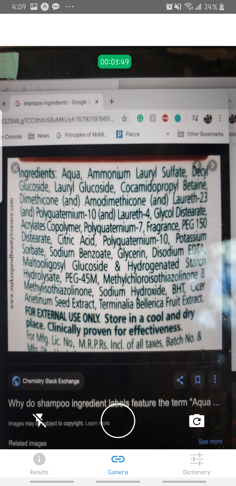
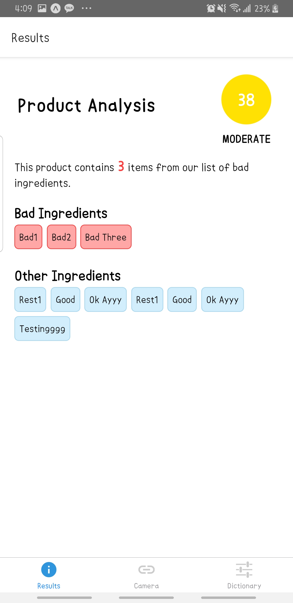
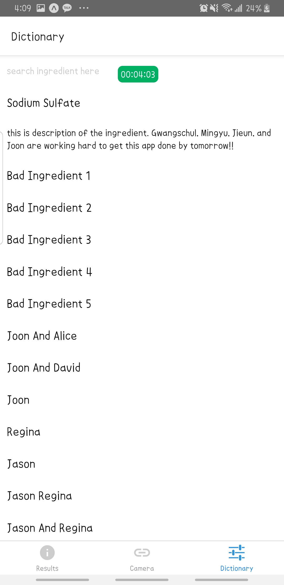

# nwhacks2020_inGRADEient

Mobile Application built with React Native (Expo) on the frontend and Django on the backend. @nwHacks

## Installation

Download Expo app on your device

```bash
npm install
npm start
```

And then SCAN the QR Code.

## Functionality

Take a picture of ingredients on the back of the product to see which ingredients are good and bad for you and which ingredients are enviromentally friendly.

## Screens
Take a picture



See the results



Search for certain ingredients if your camera functionality doesn't work!




## Challenges

Implemented OCR Google Cloud API to read texts on the picture. It was difficult for the app to recognize which part of the text was actually the ingredient as the ingredient 'box' came in different sizes, there were always other words that came with the picture.

The other option was to crop the picture on the frontend, but with our experience, that was another challenge as well.

Another challenge we faced was sending a picture to the backend server. We attempted to send it over HTTP request but failed.
